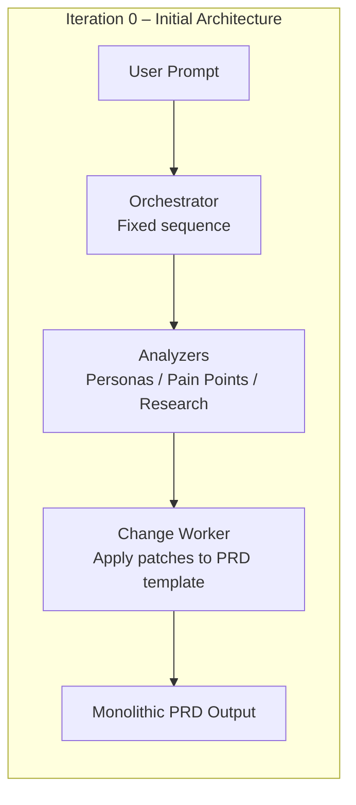
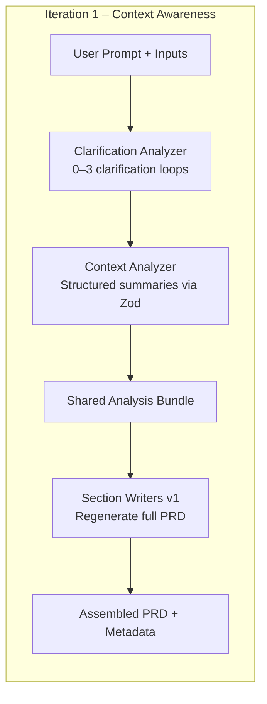
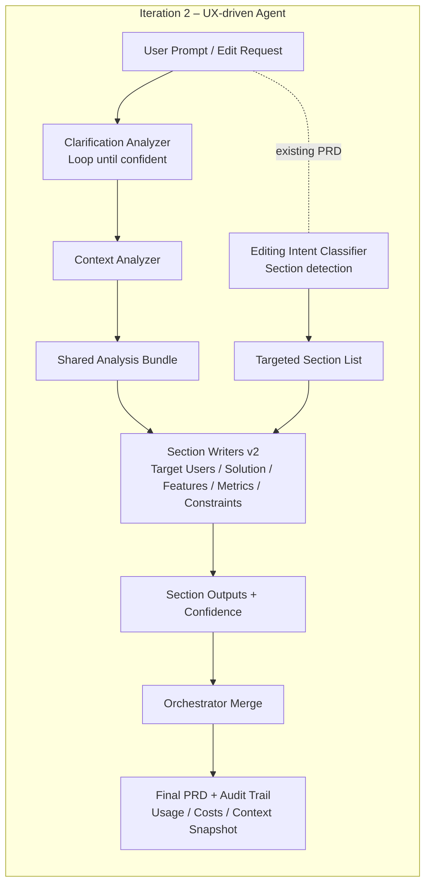

# Building a PRD Agent: Iterating on Orchestration, Context, and UX

Many challenges in AI products don’t originate only from weak prompting or orchestration gaps. A recurring pattern appears at the **UX layer**: hidden context, unclear system capabilities, opaque wait times, and large undifferentiated text outputs. I first ran into these issues while using ChatGPT to draft and maintain PRDs for my own work — reusing variations of the same prompt, manually managing context, and repeatedly tweaking outputs to keep them aligned. The workflow “worked,” but it felt labor-intensive and brittle.

That experience led to a broader question: **What would it take for an agent to produce and maintain a complex artifact like a PRD without so much manual prompting, context oversight, and guesswork?** And more specifically, how would changes in agent architecture and UX design influence the usability and predictability of such a system?

This write-up documents the technical and UX explorations behind building a PRD-focused agent — not as a product, but as a laboratory. The domain is narrow on purpose: PRDs require structure, iteration, memory, and precision, making them a useful testbed for studying **orchestration patterns, context engineering, and agent UX**. Although the work remains experimental, the lessons seem relevant to **any multi-step, artifact-producing AI workflow**.

---

## Table of Contents
- [Audience and Stack](#audience-and-stack)
- [Iteration 0 – Initial Architecture](#iteration-0--initial-architecture)
- [Iteration 1 – Context Awareness](#iteration-1--context-awareness)
- [Iteration 2 – UX-Driven Agenting](#iteration-2--ux-driven-agenting)
  - [Key UX Principles and Screens](#key-ux-principles-and-screens)
  - [Architectural Shifts Backing the UX](#architectural-shifts-backing-the-ux)
  - [Agent UX Principles (Working Draft)](#agent-ux-principles-working-draft)
- [Creation vs. Editing](#creation-vs-editing)
- [Conclusion](#conclusion)
- [Working Hypotheses](#working-hypotheses)
- [References](#references)

---

## Audience and Stack

- **Audience:** AI engineers, architects, product designers, and UX practitioners working on multi-step or long-running agent systems.
- **Stack:** TypeScript monorepo, Vercel AI SDK, Zod schemas, Next.js frontend, OpenRouter integration.
- **Influences:**  
  Anthropic on orchestration and context engineering,[1](https://www.anthropic.com/engineering/building-effective-agents), [2](https://www.anthropic.com/engineering/effective-context-engineering-for-ai-agents)  
  Breunig on context failures and curation,[3](https://www.dbreunig.com/2025/06/22/how-contexts-fail-and-how-to-fix-them.html), [4](https://www.dbreunig.com/2025/06/26/how-to-fix-your-context.html)  
  Luke Wroblewski on UX patterns in AI,[5](https://lukew.com/ff/entry.asp?2107), [6](https://lukew.com/ff/entry.asp?2113)  
  Jakob Nielsen on wait-time transparency and “Slow AI.”[7](https://jakobnielsenphd.substack.com/p/slow-ai)

---

## Iteration 0 – Initial Architecture

The first version used a straightforward pattern:

1. Orchestrator in a fixed order  
2. Analyzer subagents  
3. A single PRD writer

This produced basic outputs, but surfaced early issues:

- **All context flowed forward** → expensive and harder to reason about  
- **Any change regenerated the full document** → wasteful and slow  
- **UI hid system behavior** → users waited behind a spinner, with no visibility

These UX and architecture issues were entangled, not separate.

---

## Iteration 1 – Context Awareness

Applying ideas from Anthropic and Breunig, the agent evolved toward **planned cognition and curated context**:

- Added a clarification phase  
- Introduced Zod-validated structured summaries  
- Split **creation context vs. editing context**  
- Restricted context propagation

These adjustments improved grounding and editability, but UX limitations remained — especially around transparency and control.

---

## Iteration 2 – UX-Driven Agenting

At this point, the work shifted toward **system legibility**. Wroblewski highlights recurring UX gaps in AI around **context awareness, capability awareness, and readability**,[5](https://lukew.com/ff/entry.asp?2107) and Nielsen emphasizes transparency around wait time for “Slow AI.”[7](https://jakobnielsenphd.substack.com/p/slow-ai)

These insights suggested that UX requirements should shape orchestration decisions, not just react to them.

### Key UX Principles and Screens

**1. Visible Capabilities + Streaming (addressing “Slow AI”)**

  
*Starter affordances clarify what the agent can do. Streaming exposes long-running steps to reduce ambiguity.*

**2. Context Awareness and Control**

  
*Users can inspect, pin, or exclude context items before generation.*

**3. Structured Output Instead of “Walls of Text”**

  
*Structured components allow partial edits and reduce cognitive load.*

**4. Inspectability and Control (Configuration Drawer)**

**5. Localized Updates (Section-level Editing)**

**6. Cost Visibility**

### Architectural Shifts Backing the UX

The UI work only “clicked” once the agent runtime supported it. Every visible affordance required a corresponding architectural move:

| UX Need | Architecture Change | How It Works in Code |
|---|---|---|
| Localized edits | Section-level writers | `packages/prd-agent/agent/src/prd-orchestrator-agent.ts` maintains dedicated writers (Target Users, Solution, Features, Metrics, Constraints) so the orchestrator can regenerate only the affected sections. The editing classifier routes user intents (“update personas”) to the right writer instead of rebuilding the entire PRD. |
| Explainability | Orchestrator hooks for intermediate artifacts | The orchestrator emits progress events and returns analyzer payloads before final assembly. These hooks drive the status stream (`worker_start`, `worker_complete`) that the frontend renders as visible steps, making the agent’s cognition legible. |
| Streaming transparency | Event-based UI updates | Progress callbacks stream over Server-Sent Events, letting the frontend update the timeline and status indicators as each subagent completes—no more opaque spinner while the model works. |
| Inspectable context | Shared analysis bundle + context registry | Analyzer outputs are cached in a shared bundle and merged with the user-maintained context registry (`packages/prd-agent/frontend/lib/context-storage.ts`). That bundle powers the context inspector UI where users can pin, mute, or delete items before the writers consume them. |
| Repeatability | Audit logs and metadata | Every run captures usage metrics, cost estimates, and section-level metadata. The frontend replays that audit trail so users can trace what changed, which model handled it, and how many tokens it cost. |

Together these shifts align the system’s internal representations with what the UI promises—when the interface says “only this section will change” or “here’s the context you’re about to send,” the architecture makes that statement true.

---

### Agent UX Principles (Working Draft)

> These exploratory principles emerged while iterating on the agent — not as final conclusions, but as patterns that *seemed to improve usability*:
> 
> 1. **Expose System Cognition** — When the agent thinks, show its phases (streaming, intermediate artifacts).  
> 2. **Let Users Curate Context** — Treat context as a user-visible surface.  
> 3. **Structure the Artifact** — Use sections and diffs, not monolithic text.  
> 4. **Localize Change** — Architect so edits update only what changed.  
> 5. **Make Capabilities Legible** — Provide affordances and visible configuration.  
> 6. **Reduce Waiting Ambiguity** — If the system must be slow, it should not be silent.

---

## Creation vs. Editing

There’s no toggle between “create” and “edit” in the UI. Instead, the orchestrator inspects the request—and the presence (or absence) of an existing PRD—to decide whether it should synthesize an entire document or focus on specific sections. That inference is handled by the same subagents we’ve already seen: the clarification analyzer checks if the agent has enough information to write anything, and the section-detection analyzer decides which slices of the artifact need attention.

| Detected Workflow | System Behavior | UX Goal | Typical UX Affordances |
|---|---|---|---|
| Full PRD generation | Multi-step synthesis across every section | Transparency | Clarification loop (up to three passes), context preview, streaming timeline, cost meter |
| Targeted update | Regenerate only the sections flagged by the analyzer | Precision | Section highlights, diff view, rollback controls, warnings when edits ripple into adjacent sections |

### How the Orchestrator Makes the Call

- **Clarification acts as a gatekeeper:** When no prior PRD exists, the orchestrator will loop with the clarifier (up to three times) to gather personas, goals, and constraints before any section writers run. If the user supplies an existing PRD, the clarifier usually stands down because the grounding context is already available.
- **Section detection scopes the work:** The `section-detection-analyzer` infers intent (“update the LATAM personas”) and hands the orchestrator a targeted section list. Only those section writers get invoked unless the analyzer indicates the request touches multiple areas.
- **Shared analysis keeps context in sync:** Both scenarios reuse cached analyzer outputs whenever possible. A targeted update will draw from the existing analysis bundle and current PRD text instead of regenerating everything from scratch.
- **Audit logs reflect the path taken:** When the orchestrator opts for full generation, the audit trail captures every section output and the clarifier’s reasoning. For targeted updates it records before/after diffs, confidence scores, and the sections that actually changed—mirroring what the UI presents.

So while users don’t flip between modes, the system has a working theory about which workflow they expect. Making that inference explicit—and surfacing it through the UX affordances—has reduced surprises when moving between drafting and maintenance tasks.

---

## Working Hypotheses

1. **Context is a user-facing product surface.** Expose it.  
2. **Streaming is not cosmetic.** It is trust-preserving UX for “thinking systems.”  
3. **Structured outputs outperform walls of text.**  
4. **Creation and editing require different mental models.**  
5. **UX and orchestration must co-evolve.** One cannot be downstream of the other.

---

## Conclusion

This exploration began with a practical frustration described in the introduction: using general-purpose agents like ChatGPT to create and maintain PRDs required repeating prompts, managing context by hand, and working through long, opaque generation cycles. The core friction wasn’t just in the model, but in the *UX around the workflow* — hidden state, unclear progress, and outputs that were difficult to iterate on.

Building a domain-specific PRD agent became a way to investigate whether orchestration patterns, context design, and UX choices could reduce that friction. The current version now includes structured outputs, context controls, streaming transparency, and targeted editing — enough functionality that, for this specific use case, it feels like a more effective alternative to a general-purpose chat interface.

The project is still in motion, and the outcomes are not final. But the journey so far suggests that **domain-specific UX and architecture — designed together, from the start — may meaningfully improve how people collaborate with AI on complex, evolving artifacts**. The next steps will likely focus on validating these ideas with real users, refining the orchestration, and testing additional mechanisms for consistency and context evolution.

---

## References

1. Anthropic, *“Building Effective Agents.”*  
2. Anthropic, *“Effective Context Engineering for AI Agents.”*  
3. Dan Breunig, *“How Contexts Fail (and How to Fix Them).”*  
4. Dan Breunig, *“How to Fix Your Context.”*  
5. Luke Wroblewski, *“Common AI Product Issues.”*  
6. Luke Wroblewski, *“Context Management UI in AI Products.”*  
7. Jakob Nielsen, *“Slow AI.”*  

---
