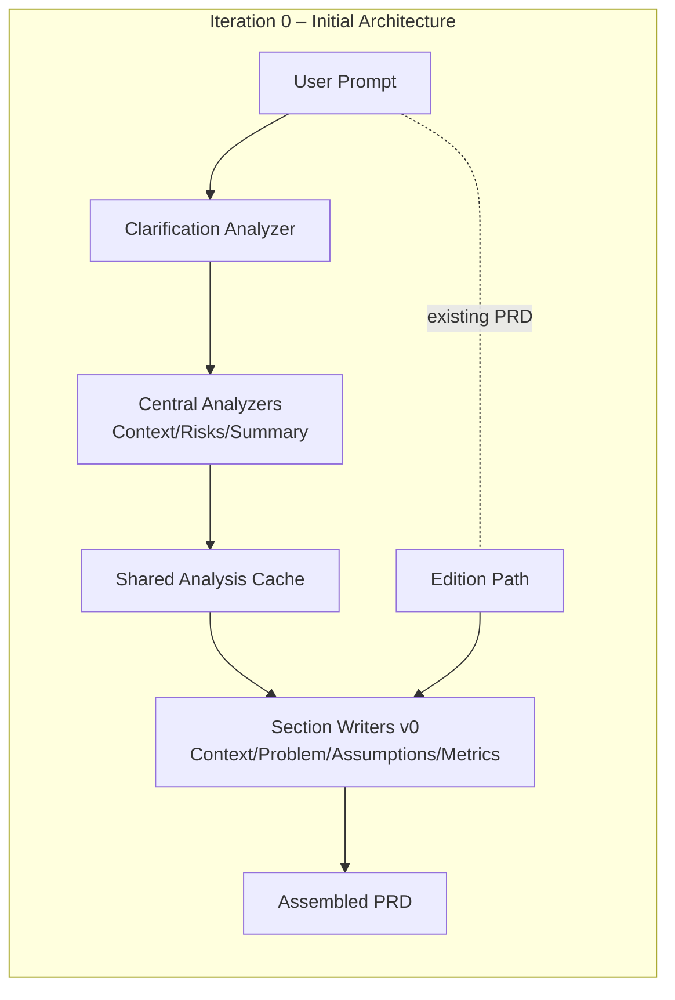
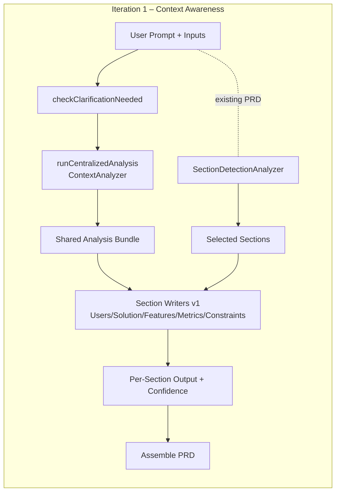
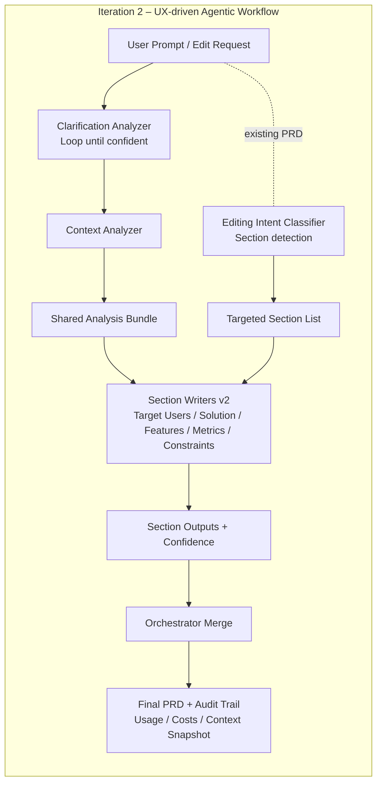
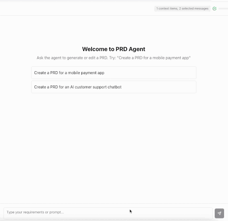

# Building a PRD Agentic Workflow: Iterating on Orchestration, Context, and UX

Many challenges in AI products may stem less from choosing frameworks or platforms and more from exploring how the user experience and the underlying architecture support each other. I first noticed this while using ChatGPT to draft and maintain PRDs—reusing prompt variants, manually curating context, and repeatedly tweaking outputs to keep them aligned. The workflow “worked,” but it felt labor‑intensive and brittle.

That experience raised a question: **What might it take for an agentic workflow to produce and maintain a complex artifact like a PRD without so much manual prompting, context oversight, and guesswork?** And more specifically, how could changes in workflow architecture and UX design influence the usability and predictability of such a system?

This write‑up shares early technical and UX explorations behind building a PRD‑focused agentic workflow—not as a product, but as a working lab to test ideas and hypotheses. The domain is narrow on purpose: PRDs require structure, iteration, memory, and precision, making them a useful testbed for studying **orchestration patterns, context engineering, and agent UX**. Although the work remains exploratory, the lessons may be relevant to **multi‑step, artifact‑producing AI workflows**.

Terminology and scope: This is an agentic workflow—LLMs and tools orchestrated through predefined code paths—rather than an autonomous agent that directs its own tools. The hypotheses here are exploratory and intended to inform agents and AI‑powered products more broadly; this project is a working lab, not a shipped product.

---

## Table of Contents
- [Audience and Stack](#audience-and-stack)
- [Iteration 0 – Initial Architecture](#iteration-0--initial-architecture)
- [Iteration 1 – Context Awareness](#iteration-1--context-awareness)
- [Iteration 2 – UX-Driven Agentic Workflow](#iteration-2--ux-driven-agentic-workflow)
  - [Key UX Principles and Screens](#key-ux-principles-and-screens)
  - [Architectural Shifts Backing the UX](#architectural-shifts-backing-the-ux)
  - [Agentic Workflow UX Principles (Working Draft)](#agentic-workflow-ux-principles-working-draft)
- [Creation vs. Editing](#creation-vs-editing)
- [Conclusion](#conclusion)
- [Working Hypotheses](#working-hypotheses)
- [References](#references)

---

## Audience and Stack

- **Audience:** AI engineers, architects, product designers, and UX practitioners working on multi-step or long-running agentic workflows and AI-powered products.
- **Stack:** TypeScript monorepo, Vercel AI SDK, Zod schemas, Next.js frontend, OpenRouter integration.
- **Influences:**  
  Anthropic on orchestration and context engineering,[1](https://www.anthropic.com/engineering/building-effective-agents), [2](https://www.anthropic.com/engineering/effective-context-engineering-for-ai-agents)  
  Breunig on context failures and curation,[3](https://www.dbreunig.com/2025/06/22/how-contexts-fail-and-how-to-fix-them.html), [4](https://www.dbreunig.com/2025/06/26/how-to-fix-your-context.html)  
  Luke Wroblewski on UX patterns in AI,[5](https://lukew.com/ff/entry.asp?2107), [6](https://lukew.com/ff/entry.asp?2113)  
  Jakob Nielsen on wait-time transparency and “Slow AI.”[7](https://jakobnielsenphd.substack.com/p/slow-ai)

---

## Iteration 0 – Initial Architecture

The first version established the core shape of the workflow:

- Clarification gate before analysis — Ensures there’s enough grounding to write anything; the system asks 0–3 targeted questions, then proceeds or returns with gaps. Example: if “target users” is missing, it prompts for personas and primary jobs-to-be-done before any writer runs.  
- Centralized analyzers: Context, Risks, Summary — Consolidates one-pass extraction into a structured bundle reused by all writers, avoiding repeated reasoning and drift. Example: the risk list produced once is consumed by multiple sections needing constraints/assumptions.  
- Multiple section writers (e.g., context, problem, assumptions, metrics) — Decouples generation so sections can evolve independently and merge deterministically. Example: only the Metrics writer reruns when you request “tighten success metrics.”  
- Dual paths: full PRD generation and targeted edits — Selects creation vs. edition based on inputs and presence of an existing PRD to improve efficiency and stability. Example: if a prior PRD is supplied and the request says “update constraints,” only that slice is scheduled.  
- Shared-analysis caching to avoid redundant analyzer runs — Keys analyzer outputs by inputs so subsequent edits reuse results without recomputing. Example: copy tweaks reuse the same context summary instead of re-extracting from scratch.

Early issues still surfaced:

- Analyzer overhead and coupling increased latency  
- Early UI offered limited visibility into the workflow’s steps  
- Edition path existed but lacked confidence/telemetry to guide edits

---

## Iteration 1 – Context Awareness

Applying ideas from Anthropic and Breunig, the workflow evolved toward **planned cognition and curated context**:

- Five-section PRD redesign (Target Users, Solution, Features, Metrics, Constraints) — Aligns the artifact with audience-facing sections and reduces ambiguity about ownership. Example: “add OKRs” maps cleanly to the Metrics section.  
- Parallel section writers atop a shared ContextAnalyzer result — Lowers latency and coupling by letting independent writers run concurrently on the same structured inputs. Example: Solution and Features complete in parallel.  
- LLM-driven SectionDetectionAnalyzer for edit routing and autodetecting existing PRDs — Interprets requests and selects affected sections, and if a PRD is present, defaults to edition. Example: “tighten constraints about latency” routes only to Constraints.  
- Confidence metadata per section to aid UX transparency — Each output carries a confidence hint so the UI can flag fragile changes. Example: low confidence on Personas nudges the user to review.  
- Modularized pipeline helpers (clarification check, shared analysis, parallel sections, assembly) — Improves maintainability and testability; responsibilities are isolated so new writers or analyzers slot in without side effects.

---

## Iteration 2 – UX-Driven Agentic Workflow

At this point, the work shifted toward **system legibility**. Wroblewski highlights recurring UX gaps in AI around **context awareness, capability awareness, and readability**,[5](https://lukew.com/ff/entry.asp?2107) and Nielsen emphasizes transparency around wait time for “Slow AI.”[7](https://jakobnielsenphd.substack.com/p/slow-ai)

These insights suggested that UX requirements should shape orchestration decisions, not just react to them.

What changed and why:

- Streaming progress events — Reduces “Slow AI” ambiguity by emitting `worker_start`, partials, and `section_complete` in real time. Example: users see Features complete before Constraints.  
- Configurable workers (per-writer runtime settings) — Allows specialization (e.g., different models/temperatures) while enforcing streaming capability for observability. Example: a concise, extractive analyzer vs. a creative section writer.  
- Usage and cost accounting — Surfaces token and cost telemetry per worker and rollups, supporting trust and iteration budgeting. Example: a heavy Features pass explains a cost spike.  
- Edition parity and fallbacks — Heuristics prevent silent no-op edits, and top-level fields stay in sync with partial updates to avoid stale PRDs. Example: editing Constraints also updates the summary if needed.

### Key UX Principles and Screens

**1. Visible Capabilities + Streaming (addressing “Slow AI”)**

  
*Starter affordances clarify what the agentic workflow can do. Streaming exposes long-running steps to reduce ambiguity.*

**2. Context Awareness and Control**

  
*Users can inspect, pin, or exclude context items before generation.*

**3. Structured Output Instead of “Walls of Text”**

  
*Structured components allow partial edits and reduce cognitive load.*

**4. Inspectability and Control (Configuration Drawer)**

**5. Localized Updates (Section-level Editing)**

**6. Cost Visibility**

### Architectural Shifts Backing the UX

The UI work only “clicked” once the agent runtime supported it. Every visible affordance required a corresponding architectural move:

| UX Need | Architecture Change | How It Works in Code |
|---|---|---|
| Localized edits | Section-level writers | `packages/prd-agent/agent/src/prd-orchestrator-agent.ts` maintains dedicated writers (Target Users, Solution, Features, Metrics, Constraints) so the orchestrator can regenerate only the affected sections. The editing classifier routes user intents (“update personas”) to the right writer instead of rebuilding the entire PRD. |
| Explainability | Orchestrator hooks for intermediate artifacts | The orchestrator emits progress events and returns analyzer payloads before final assembly. These hooks drive the status stream (`worker_start`, `worker_complete`) that the frontend renders as visible steps, making the workflow’s cognition legible. |
| Streaming transparency | Event-based UI updates | Progress callbacks stream over Server-Sent Events, letting the frontend update the timeline and status indicators as each subagent completes—no more opaque spinner while the model works. |
| Inspectable context | Shared analysis bundle + context registry | Analyzer outputs are cached in a shared bundle and merged with the user-maintained context registry (`frontend/product-agent/lib/context-storage.ts`). That bundle powers the context inspector UI where users can pin, mute, or delete items before the writers consume them. |
| Repeatability | Audit logs and metadata | Every run captures usage metrics, cost estimates, and section-level metadata. The frontend replays that audit trail so users can trace what changed, which model handled it, and how many tokens it cost. |
| Configurable workers | Per-worker runtime settings | Each analyzer/writer can override models, temperature, and API keys via `getSubAgentRuntimeSettings`, while enforcing streaming capability for progress events. |
| Edition parity & fallbacks | Heuristic coverage + field sync | Heuristics prevent silent no-op edits; top-level PRD fields stay in sync with edited sections to avoid stale data during partial updates. |

Together these shifts align the system’s internal representations with what the UI promises—when the interface says “only this section will change” or “here’s the context you’re about to send,” the architecture makes that statement true.

---

### Agentic Workflow UX Principles (Working Draft)

> These exploratory principles emerged while iterating on an agentic workflow — intended to be useful for agents and AI-powered products more broadly:
> 
> 1. **Expose System Cognition** — When the system runs/thinks, show its phases (streaming, intermediate artifacts).  
> 2. **Let Users Curate Context** — Treat context as a user-visible surface.  
> 3. **Structure the Artifact** — Use sections and diffs, not monolithic text.  
> 4. **Localize Change** — Architect so edits update only what changed.  
> 5. **Make Capabilities Legible** — Provide affordances and visible configuration.  
> 6. **Reduce Waiting Ambiguity** — If the system must be slow, it should not be silent.

---

## Creation vs. Editing

There’s no toggle between “create” and “edit” in the UI. Instead, the orchestrator inspects the request—and the presence (or absence) of an existing PRD—to decide whether it should synthesize an entire document or focus on specific sections. That inference is handled by the same subagents we’ve already seen: the clarification analyzer checks if the agent has enough information to write anything, and the section-detection analyzer decides which slices of the artifact need attention.

Confidence signals from section detection are surfaced to help users decide when to intervene.

| Detected Workflow | System Behavior | UX Goal | Typical UX Affordances |
|---|---|---|---|
| Full PRD generation | Multi-step synthesis across every section | Transparency | Clarification loop (up to three passes), context preview, streaming timeline, cost meter |
| Targeted update | Regenerate only the sections flagged by the analyzer | Precision | Section highlights, diff view, rollback controls, warnings when edits ripple into adjacent sections |

### How the Orchestrator Makes the Call

- **Clarification acts as a gatekeeper:** When no prior PRD exists, the orchestrator will loop with the clarifier (up to three times) to gather personas, goals, and constraints before any section writers run. If the user supplies an existing PRD, the clarifier usually stands down because the grounding context is already available.
- **Section detection scopes the work:** The `section-detection-analyzer` infers intent (“update the LATAM personas”) and hands the orchestrator a targeted section list. Only those section writers get invoked unless the analyzer indicates the request touches multiple areas.
- **Shared analysis keeps context in sync:** Both scenarios reuse cached analyzer outputs whenever possible. A targeted update will draw from the existing analysis bundle and current PRD text instead of regenerating everything from scratch.
- **Audit logs reflect the path taken:** When the orchestrator opts for full generation, the audit trail captures every section output and the clarifier’s reasoning. For targeted updates it records before/after diffs, confidence scores, and the sections that actually changed—mirroring what the UI presents.
- **Edition parity and fallbacks:** Heuristics prevent silent no-op edits and keep top-level PRD fields consistent during partial updates.

So while users don’t flip between modes, the system has a working theory about which workflow they expect. Making that inference explicit—and surfacing it through the UX affordances—has reduced surprises when moving between drafting and maintenance tasks.

---

## Working Hypotheses

1. **Context is a user-facing product surface.** Expose it.  
2. **Streaming is not cosmetic.** It is trust-preserving UX for “thinking systems.”  
3. **Agent-driven interactive UI and structured outputs outperform walls of text.**  
4. **Creation and editing require different mental models.**  
5. **UX and agent orchestration must co-evolve.** One cannot be downstream of the other.

---

## Conclusion

This exploration began with a practical frustration described in the introduction: using general-purpose agents like ChatGPT to create and maintain PRDs required repeating prompts, managing context by hand, and working through long, opaque generation cycles. The core friction wasn’t just in the model, but in the *UX around the workflow* — hidden state, unclear progress, and outputs that were difficult to iterate on.

Building a domain-specific PRD agent became a way to investigate whether orchestration patterns, context design, and UX choices could reduce that friction. The current version now includes structured outputs, context controls, streaming transparency, and targeted editing — enough functionality that, for this specific use case, it feels like a more effective alternative to a general-purpose chat interface.

The project is still in motion, and the outcomes are not final. But the journey so far suggests that **domain-specific UX and architecture — designed together, from the start — may meaningfully improve how people collaborate with AI on complex, evolving artifacts**. The next steps will likely focus on validating these ideas with real users, refining the orchestration, and testing additional mechanisms for consistency and context evolution.

While this implementation is an agentic workflow, the UX and UI hypotheses here apply broadly to agentic systems and to AI-powered products that orchestrate multi-step work.

---

## References

1. Anthropic, *“Building Effective Agents.”*  
2. Anthropic, *“Effective Context Engineering for AI Agents.”*  
3. Dan Breunig, *“How Contexts Fail (and How to Fix Them).”*  
4. Dan Breunig, *“How to Fix Your Context.”*  
5. Luke Wroblewski, *“Common AI Product Issues.”*  
6. Luke Wroblewski, *“Context Management UI in AI Products.”*  
7. Jakob Nielsen, *“Slow AI.”*  

---
