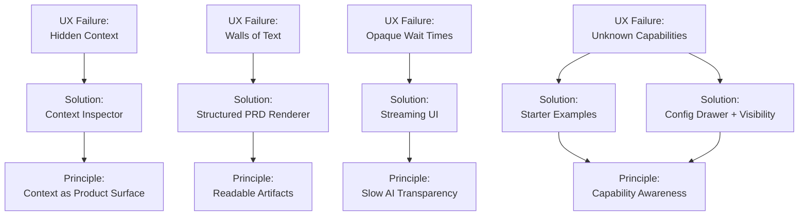

# Building a PRD Agent: Iterating on Orchestration, Context, and UX

Modern AI products don’t fail only because of weak prompts or shallow orchestration. They also fail because of **UX blind spots**: hidden context, opaque latency, “walls of text,” and no clear affordances for what the system can do. When AI has to think, users must still *understand* what is happening. That realization turned this project—from a narrow agentic experiment—into a larger exploration: **What does it take to build a useful, transparent, artifact-producing AI agent that people can trust?**

This post documents that journey through three major themes:  
1. **Orchestration patterns** to manage complexity  
2. **Context engineering** to reduce hallucinations and rework  
3. **UX principles** that make agent behavior visible, legible, and controllable

The domain was a Product Requirements Document (PRD) agent, but the lessons apply to **any multi-step, long-running, artifact-generating AI workflow**.

Nothing here is production-validated yet. This is a **lab notebook for Staff-plus AI builders** who care about orchestration *and* UX, not just model calls.

---

## Table of Contents
- [Audience and Stack](#audience-and-stack)
- [Iteration 0 – Initial Architecture](#iteration-0--initial-architecture)
- [Iteration 1 – Context Awareness](#iteration-1--context-awareness)
- [Iteration 2 – UX-Driven Agenting](#iteration-2--ux-driven-agenting)
  - [Key UX Principles and Screens](#key-ux-principles-and-screens)
  - [Architectural Shifts Backing the UX](#architectural-shifts-backing-the-ux)
- [Creation vs. Editing](#creation-vs-editing)
- [Custom UI Components](#custom-ui-components)
- [Platform Foundations and Routing](#platform-foundations-and-routing)
- [Orchestration Gaps and Next Steps](#orchestration-gaps-and-next-steps)
- [Working Hypotheses](#working-hypotheses)
- [References](#references)

---

## Audience and Stack

- **Audience:** Staff-level AI engineers, architects, and product builders designing multi-step or artifact-producing AI systems.
- **Stack:** TypeScript monorepo, Vercel AI SDK, Zod schemas, Next.js frontend, OpenRouter integration.
- **Foundational influences:**  
  Anthropic on orchestration and context engineering,[1](https://www.anthropic.com/engineering/building-effective-agents), [2](https://www.anthropic.com/engineering/effective-context-engineering-for-ai-agents)  
  Breunig on context failures and curation,[3](https://www.dbreunig.com/2025/06/22/how-contexts-fail-and-how-to-fix-them.html), [4](https://www.dbreunig.com/2025/06/26/how-to-fix-your-context.html)  
  Luke Wroblewski on AI UX pitfalls,[5](https://lukew.com/ff/entry.asp?2107), [6](https://lukew.com/ff/entry.asp?2113)  
  Jakob Nielsen on “Slow AI” and wait-time UX.[7](https://jakobnielsenphd.substack.com/p/slow-ai)

---

## Iteration 0 – Initial Architecture

The first implementation followed a simple pattern:

1. Orchestrator (fixed sequence)
2. Analyzers (personas, pain points, research)
3. Writer (generates a full PRD from a template)

This worked for trivial drafts, but three structural problems emerged:

- **Context blindness** — too much raw input passed forward
- **Rigid rewriting** — any change triggered a full-document regeneration
- **Opaque UX** — UI acted like a spinner-covered black box, the exact problem Luke Wroblewski highlights: *users don’t know what the system knows, used, or is doing.*[5](https://lukew.com/ff/entry.asp?2107)

The architecture needed discipline, and the UX needed transparency.

---

## Iteration 1 – Context Awareness

Guided by Anthropic and Breunig, I restructured the agent to **plan cognition** and **curate context** instead of dumping text.

**Key changes**
- A **clarification phase** before drafting
- **Zod-validated structured summaries** stored in a Shared Analysis Bundle
- **Separated creation vs. editing context**
- **Controlled context flow** between subagents

This stabilized grounding and reduced hallucinations, but editing was still inefficient—and the UX still created unnecessary uncertainty.

---

## Iteration 2 – UX-Driven Agenting

The breakthrough came when I treated UX not as output decoration, but as **part of the agent system architecture**. Wroblewski identifies three recurring UI failures in AI products—lack of **context awareness**, **capability awareness**, and **readability**.[5](https://lukew.com/ff/entry.asp?2107), [6](https://lukew.com/ff/entry.asp?2113) Nielsen adds a fourth: **wait-time opacity in “Slow AI.”**[7](https://jakobnielsenphd.substack.com/p/slow-ai)

So v2 directly targeted those four UX failure modes.

### Key UX Principles and Screens

**1. Visible Capabilities & Transparency via Streaming (to address “Slow AI”)**  
Pre-shown affordances help users understand what the agent can do before they type. Once the user starts prompting, long-running orchestration steps stream to the UI using AI SDK + Next.js, reducing user anxiety.

  
*Pre-shown affordances. Real-time streaming reveals each orchestration step, preventing “black-box waiting” and aligning with Nielsen’s Slow AI guidance.*

**2. Context Awareness and Control**  
The UI exposes which messages and documents will be passed as context, and allows pin/remove actions.

  
*Explicit context curation prevents invisible hallucination sources and matches Wroblewski’s “context awareness” principle.*

**3. Structured PRD Rendering (no walls of text)**  
PRDs render as structured sections with field controls, metadata, and inline comments.

  
*Replacing undifferentiated blobs with structured components solves the “wall of text” UX failure.* 

**4. Inspectability and Control (Configuration Drawer)**

  
*Users can inspect or override model, temperature, and analyzer settings without leaving the flow.*

**5. Surgical Editing, Not Full Regeneration**

  
*Only the affected section regenerates—reducing cost, latency, and regression risk.*

**6. Cost Visibility**

  
*Token and cost transparency enables responsible iteration.*

### Architectural Shifts Backing the UX
These UX goals required the agent architecture to change:

- Replaced monolithic writer → **section writers**
- Added **editing intent classifier**
- Added **orchestrator hooks for intermediate artifacts**
- Added **audit logs and metadata history**

**UX and architecture now evolved together**—not as separate layers.

---

## Creation vs. Editing

This project now treats **creation** and **editing** as distinct workflows:

| Mode | Context | UX Priority | Behavior |
|---|---|---|---|
| **Creation** | High-context synthesis | Transparency | Multi-step drafting |
| **Editing** | Localized updates | Precision | Section-level regeneration |

This separation reduced errors and token waste, and made the workflow more legible for users.

---

## Custom UI Components

Generic chat UIs are insufficient for complex agent outputs. The system now includes:

- PRD Section Renderer  
- Context Inspector  
- Configuration Drawer  
- Cost Meter  
- Inline diff / comments support  
- Streaming progress panel

Each UI element exists to *prevent a known AI UX failure*.

---

## Platform Foundations and Routing

Brief highlights:

- Monorepo with shared packages (`agent-core`, `ui-components`, `openrouter-client`)
- Capability-based model routing
- Serverless-friendly orchestration primitives

---

## Orchestration Gaps and Next Steps

Planned explorations:

- Policy-based dynamic routing
- Verification agents for consistency checks
- Automatic context pruning heuristics
- Broader UX testing with PMs and engineers

---

## Working Hypotheses

1. **Context is a user-facing product surface.** Expose it.  
2. **Streaming is not cosmetic.** It is trust-preserving UX for “thinking systems.”  
3. **Structured outputs outperform walls of text.**  
4. **Creation and editing require different mental models.**  
5. **UX and orchestration must co-evolve.** One cannot be downstream of the other.

---

---

## References

1. Anthropic, *“Building Effective Agents.”*  
2. Anthropic, *“Effective Context Engineering for AI Agents.”*  
3. Dan Breunig, *“How Contexts Fail (and How to Fix Them).”*  
4. Dan Breunig, *“How to Fix Your Context.”*  
5. Luke Wroblewski, *“Common AI Product Issues.”*  
6. Luke Wroblewski, *“Context Management UI in AI Products.”*  
7. Jakob Nielsen, *“Slow AI.”*  

---
