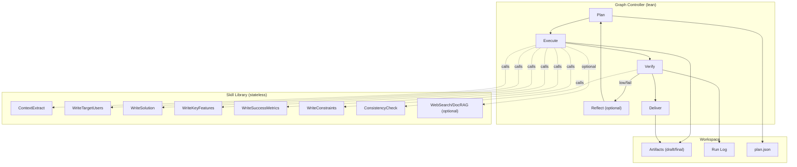

# Deep Agent Definitions and References

Before diving into the architecture, this document aligns with the **Deep Agent** principles introduced by:

* **Phil Schmid — [Agents 2.0: Deep Agents Architecture](https://www.philschmid.de/agents-2.0-deep-agents)**
* **LangChain — [Deep Agents: Towards Multi-Layer Reasoning Systems](https://blog.langchain.com/deep-agents/)**

**Definition:**
Deep Agents are AI systems that go beyond reactive, single-loop execution. They incorporate *planning, reflection, hierarchical control, memory, and verification* to reason over longer horizons and complex tasks. Instead of executing one prompt at a time (“shallow agents”), Deep Agents explicitly structure work into stages: **Plan → Act → Observe → Reflect → Replan**.

Key traits:

* **Explicit Planning:** Agents define goals, subgoals, and execution steps before acting.
* **Reflection & Verification:** Agents evaluate outputs, detect failures, and adapt plans.
* **Memory:** They use short-term (episodic) and long-term (semantic) memory to maintain context and reuse knowledge.
* **Hierarchical Composition:** Complex agents orchestrate smaller, specialized agents or tools.

This specification adopts these ideas pragmatically, focusing on a lean implementation that delivers *depth* (reasoning, planning, reflection) without unnecessary complexity.

---

# Technical Design Specification — Deep Agent Architecture (Product Agents)

## 0. Document status

* **Version:** 1.1 (approved)
* **Owner:** AI Engineering
* **Audience:** Product/Platform engineers, Tech leads
* **Scope:** Refactor “shallow” Product Agents into a **Deep Agent** with planning, verification, and (optional) reflection—while avoiding over-engineering.

---

## 1. Goals & Non-Goals

### Goals

* Increase reliability on multi-step work via explicit **Plan → Execute → Verify → Deliver** control flow.
* Establish a **Skill-first** execution model (stateless, uniform, testable).
* Add a single, centralized **Verifier** (schema + rubric + light consistency).
* Persist artifacts for **auditability** and reproducibility.
* Keep complexity low; **only** add Reflection, Memory, and Subagents when justified.

### Non-Goals

* No hierarchical “manager-of-managers” subagent trees in v1.
* No heavy RAG or knowledge graph by default.
* No microservice split; run in-process unless API/UI requires otherwise.

---

## 2. Target Architecture (Lean Core-5)

* **Graph Controller (graph-lite):** Drives phases, step dependencies, retries, and the reflection branch.
* **Planner (contracts):** Produces short plan (≤7 steps), per-step output specs and 1–3 success criteria.
* **Skill Runner (stateless):** Uniform adapter to call LLM prompts/tools; returns `{artifact, trace}`.
* **Verifier (pure):** Validates artifacts vs. schema/rubric; aggregates to `pass | low | fail`.
* **Workspace (minimal):** Stores plan, drafts, finals, and a small run log.

Optional (add when triggers occur):

* **Reflection:** `planner.reflect(issues)` creates a minimal plan/constraint patch.
* **Semantic Memory:** `retrieve(query) → passages[]` for tasks needing external facts.
* **Subagents:** Only when a capability needs internal planning/branching/iteration.

### 2.1 Component/Flow Diagram



### 2.2 Multi-Agent Layering & Registry

* **Product Agent as orchestrator:** The top-level controller now focuses on planning cross-artifact work and delegating execution to registered subagents rather than owning the PRD flow directly.
* **Package-per-subagent:** Each major capability ships as its own package implementing `SubagentLifecycle` (e.g., `prd-agent`, `persona-agent`, `research-agent`, `story-mapper-agent`). Every package can run independently or be invoked by the orchestrator.
* **Registry-driven discovery:** A manifest/registry advertises each subagent’s id, artifact kind, accepted source kinds, and capability tags. The intelligent planner queries this registry to decide which subagents belong in the plan graph.
* **Composable hand-offs:** Subagents emit workspace artifacts that the orchestrator feeds into downstream subagents (PRD → persona → story map, etc.), enforcing verification checkpoints between them.
* **Skills remain granular:** Subagents may internally reuse the shared skill packs, but to the orchestrator they appear as coarse “agent” nodes that can plan/iterate on their own.

---

## 3. Skill vs Subagent (Decision Framework)

* **Skill (default):** Stateless function with a strict contract; no internal loops.
  `run(input) → {artifact, trace}`
* **Subagent (opt-in):** Stateful goal-seeker packaged as an agent module with internal plan/iterate/verify/tool-choice; can execute standalone or be orchestrated (e.g., `prd-agent`, `persona-agent`).

**Promotion triggers (use ≥2 to justify):**

1. Tool/strategy **choice** (branching).
2. ≥2 internal **iterations** with learning from failures.
3. Needs **stateful** memory inside the box.
4. Latency tolerance for better quality.
5. Isolation/failure-domain requirement.

---

## 4. Data Contracts

### 4.1 Plan

```ts
type StepId = string;

interface Plan {
  steps: Array<{
    id: StepId;
    skill: string;                 // e.g., "WriteSuccessMetrics"
    deps?: StepId[];               // default: []
    outputsSpec: any;              // JSON schema
    success: string[];             // 1–3 rubric items
    retryBudget?: number;          // default: 1
    timeoutSec?: number;           // default: 90
  }>;
}
```

### 4.2 Artifacts & Traces

```ts
interface Artifact {
  stepId: StepId;
  kind: 'section'|'notes'|'sources'|'plan';
  data: unknown;
  provenance: Trace;                 // prompt, model, tokens, duration
}

interface Trace {
  spanId: string;
  model: string;
  tokens: {prompt: number; completion: number};
  durationMs: number;
  cost?: number;
}
```

### 4.3 Verification

```ts
type VerifyStatus = 'pass'|'low'|'fail';

interface VerifyIssue {
  stepId: StepId;
  kind: 'schema'|'rubric'|'consistency';
  msg: string;
}

interface VerifyResult {
  status: VerifyStatus;
  score: number;        // 0–1
  issues: VerifyIssue[];
}
```

---

## 5. Execution Flows

5.1 End-to-End Sequence

```
sequenceDiagram
  autonumber
  participant U as User/Client
  participant GC as Graph Controller
  participant PL as Planner
  participant SR as Skill Runner
  participant VF as Verifier
  participant WS as Workspace

  U->>GC: startRun(message, context)
  GC->>PL: makePlan(context)
  PL-->>GC: Plan{steps, specs, success}
  GC->>WS: save(plan.json)

  par Execute steps (parallel where deps allow)
    loop per step
      GC->>SR: run(step, inputs)
      SR-->>GC: {artifact, trace}
      GC->>WS: persist(draft)
    end
  end

  GC->>VF: verify(plan, artifacts)
  VF-->>GC: VerifyResult{pass|low|fail}

  alt pass
    GC->>WS: persist(final bundle)
    GC-->>U: deliver(outputs, report)
  else low/fail
    GC->>PL: reflect(issues)   %% optional
    PL-->>GC: Plan (patched)
    GC->>SR: rerun(affected steps)
    GC->>VF: re-verify(scope)
    VF-->>GC: pass
    GC->>WS: persist(final bundle)
    GC-->>U: deliver(outputs, report)
  end
```
5.2 Micro-Loop (Single Step with Retry/Reflect)
```
sequenceDiagram
  autonumber
  participant GC as Graph Controller
  participant PL as Planner
  participant SR as Skill (e.g., WriteSuccessMetrics)
  participant VF as Verifier
  participant WS as Workspace

  GC->>PL: get step contract
  PL-->>GC: outputsSpec + success + retryBudget

  GC->>SR: run(step, inputs)
  SR-->>GC: artifact v1
  GC->>WS: persist v1
  GC->>VF: verify(v1)
  VF-->>GC: low/fail?

  alt low/fail and retries left
    GC->>PL: reflect(issues) // returns hints/constraints
    PL-->>GC: patch
    GC->>SR: rerun with patch
    SR-->>GC: artifact v2
    GC->>VF: re-verify
    VF-->>GC: pass
  else pass
    GC->>WS: mark final
  end
```
5.3 Verifying Sub-State Machine (Expanded)
```
stateDiagram-v2
  state Verifying {
    [*] --> Init
    Init --> Schema
    Init --> Rubric
    Init --> Consistency
    state Schema {
      [*] --> ValidateFormat
      ValidateFormat --> Pass : ok
      ValidateFormat --> Fail : mismatch
      Pass --> [*]
      Fail --> [*]
    }
    state Rubric {
      [*] --> Score
      Score --> Pass : ≥ threshold
      Score --> Low : borderline
      Score --> Fail : < min
      Pass --> [*]
      Low --> [*]
      Fail --> [*]
    }
    state Consistency {
      [*] --> Compare
      Compare --> Pass
      Compare --> Fail
      Pass --> [*]
      Fail --> [*]
    }
    Schema --> Aggregate
    Rubric --> Aggregate
    Consistency --> Aggregate
    state Aggregate {
      [*] --> Combine
      Combine --> Pass : all pass
      Combine --> Low : any low, none fail
      Combine --> Fail : any fail
      Pass --> [*]
      Low --> [*]
      Fail --> [*]
    }
  }
```

---

## 6. APIs (if/when exposed)

* `POST /runs` → `{ message, context? }` → `{ runId }`
* `GET /runs/:id` → run summary + verify result
* `GET /runs/:id/artifacts` → list/download outputs
* `GET /runs/:id/stream` → (optional) SSE progress

> External API **required** in v1.

---

## 7. Minimal Interfaces (TypeScript)

```ts
// Controller
type RunState = 'planning'|'executing'|'verifying'|'reflecting'|'delivering'|'done'|'error';

interface Controller {
  start(input: { message: string; context?: any }): Promise<{ runId: string }>;
  get(runId: string): Promise<RunSummary>;
}

// Planner
interface Planner {
  makePlan(ctx: any): Promise<Plan>;
  reflect?(issues: VerifyIssue[], plan: Plan): Promise<Plan>;
}

// Skill
type Skill = (input: unknown, cfg?: SkillCfg)
  => Promise<{ artifact: unknown; trace: Trace }>;

interface SkillCfg {
  timeoutMs?: number; retries?: number; model?: string;
}

// Verifier
type Verifier = (plan: Plan, artifacts: Record<string, Artifact>)
  => VerifyResult;

// Workspace
interface Workspace {
  put(runId: string, path: string, data: any): Promise<void>;
  get(runId: string, path: string): Promise<any>;
  list(runId: string): Promise<string[]>;
}

```

---

## 8. Non-Functional Requirements

* **Reliability:** ≥85% first-pass verify pass-rate; bounded retries (≤2 per step).
* **Latency:** Median end-to-end ≤ 25s for a 5-step PRD; parallelize independent steps.
* **Cost:** Track tokens/cost per step; variance ≤ ±20% month-over-month (same workload).
* **Security:** No PII persists unless configured; redact prompts in trace export.
* **Observability:** Single JSON run report (`run.json`) with spans, costs, verify result.

---

## 9. Recommended Refactor Path
**Phase 0 – Verifier & Workspace (No Control-Flow Changes)**

- Add a workspace.ts and verifier.ts. 
- Persist plan.json, artifacts, verify results, and run logs.
- Centralize schema/rubric checks.

**Phase 1 – Planner + Skill Runner**

- Introduce planner.ts to formalize steps with outputsSpec, rubrics, retry budgets.
- Add skill-runner.ts as a uniform facade over existing writers.
- Wrap each artifact with a standard Trace from OpenRouterClient.

**Phase 2 – Graph Controller + Reflection**

- Build a tiny state machine (planning → executing → verifying → reflecting → delivering).
- Implement planner.reflect(issues) for minimal prompt/constraint patching.
- Retry only affected steps and emit structured progress events.

## Suggested New Files
```bash
agent/src/controller/graph-controller.ts
agent/src/planner/planner.ts
agent/src/skills/skill-runner.ts
agent/src/verify/verifier.ts
agent/src/store/workspace.ts
agent/src/types/deep-agent.ts
```

## 10. Client-State Strategy (Interim)

- The frontend run store/local storage (Next.js `run-store`) remains the temporary source of truth for artifacts produced by subagents (PRD bundles, personas, story maps) until backend persistence spans multiple artifact kinds.
- Each client request to the thin API must include the serialized artifact context that downstream subagents require (e.g., pass the PRD artifact when triggering persona/story-map runs) so the orchestrator can hydrate `sourceArtifact` without rereading server state.
- Derived artifacts cached on the client are reattached to the run via metadata when the orchestrator responds, keeping the UI synchronized even though storage is local-first for now.
