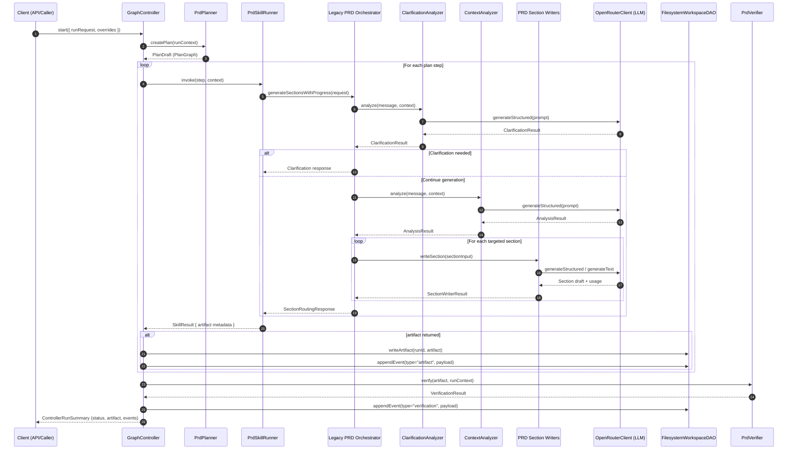

# Product Agent PRD Generation Sequence

**Key Notes**

- The adapter layer (planner, skill runner, verifier) bridges the generic graph controller with the legacy PRD orchestrator while the refactor is in progress.
- `FilesystemWorkspaceDAO` maintains artifact snapshots and event journals on disk per run, ensuring parity with the future persistent workspace contract.
- Progress events emitted inside the controller can stream back to the caller (e.g., via SSE) for live run updates.
- Clarification and context analyzers (`packages/prd-agent/agent/src/prd-orchestrator-agent.ts`) call into `OpenRouterClient.generateStructured` via the analyzer base class before section drafting begins.
- Section writers (`packages/prd-agent/agent/src/section-writers/`) rely on `OpenRouterClient` methods to produce section drafts and usage metadata that the orchestrator aggregates.
