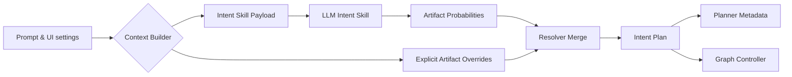
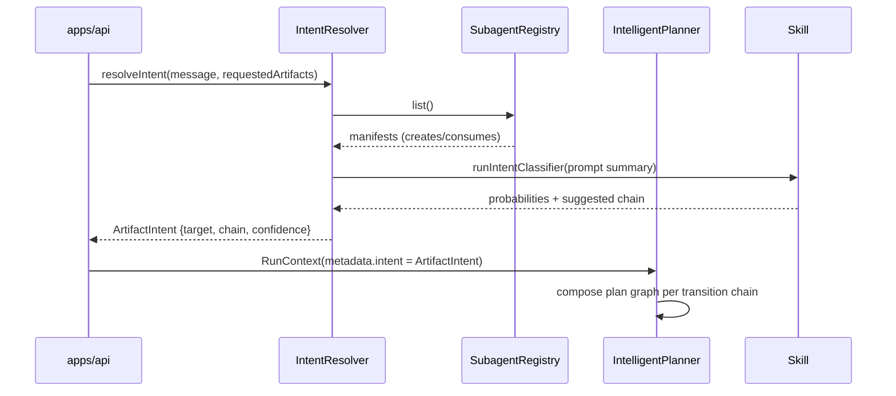

# Deep Agent Refactor TODO

> Track implementation progress across phases. Update status as work advances.

## Phase 3 – Frontend Relocation & Integration
- [x] Move Next.js app to `frontend/product-agent` and fix import paths.
- [x] Wire UI data layer to thin API (`startRun`, `getRun`, `streamRun`).
- [x] Expose configuration toggles for artifact types (PRD default).
- [x] Verify Turbo `build`, `dev`, and `test` run clean after relocation.
- [x] Execute end-to-end smoke test through UI.
- [x] Relocate the thin API from `apps/mcp-server` to `apps/api` (or equivalent) so it is domain-agnostic.
- [x] Update workspace config, scripts, and deployment manifests to point at the new `apps/api` location.
- [x] Remove remaining MCP-specific references from docs and tooling to reflect the shared API surface.

### Execution Gameplan
1. Relocate the app shell into `frontend/product-agent` and adjust path aliases/imports.
2. Refactor hooks and API utilities to rely on the thin data layer (`startRun`, `getRun`, `streamRun`).
3. Surface artifact toggles in settings/components with PRD as the default selection.
4. Run Turbo `build`, `dev`, and `test` to confirm workspace wiring survives the move.
5. Perform a UI smoke pass to validate streaming, toggles, and legacy flows.

### Prep Checklist
- [x] Confirm root `tsconfig.json` and workspace aliases cover the new `frontend/product-agent` path.
- [x] Double-check `package.json` scripts reference the relocated frontend.
- [x] Note any implicit dependencies from the current frontend directory before moving files.

## Phase 2 – Skill & Utility Extraction (Completed)
- [x] Move stateless skills into `packages/skills/*` modules with shared interface.
- [x] Introduce single-file manifest (`prdSkillPack.ts`) exporting metadata and registration helpers.
- [x] Relocate shared helpers (confidence aggregation, schemas, types) into `packages/shared`.
- [x] Add contract tests validating each skill against planner/verify schemas.
- [x] Update tooling/build scripts for new skill package structure.

## Phase 4 – Subagent Enablement
- [x] Expose subagent routes through the shared thin API and validate end-to-end access via `apps/api`.
- [x] Document API contract updates so frontend and SDK consumers can call subagent endpoints.
- [x] Define subagent interfaces (inputs/outputs, lifecycle) reused across persona/research/story mapping.
- [x] Implement persona builder subagent using existing PRD artifacts.
- [x] Draft research subagent design doc (tooling, data sources).
- [x] Prototype user story mapping subagent contract mirroring PRD outputs.
- [x] Integrate subagents via skill pack configuration.
- [x] Add tests covering orchestrator + subagent integration flow.

## Phase 5 – Hardening & Cleanup
- [x] Remove deprecated orchestrator utilities from the retired PRD bundle.
  - [x] Inventory every legacy file (`prd-orchestrator-agent.ts`, HTTP utilities, adapters) and map replacements inside `packages/product-agent` + `apps/api`.
  - [x] Delete the legacy code + exports once consumers are updated so only the new controller/skill packs remain.
  - [x] Run targeted TypeScript builds/tests to ensure zero stray imports remain.
- [x] Update documentation and READMEs to reflect new package layout and config.
  - [x] Refresh root README + AGENT.md with the deep agent architecture diagram/text.
  - [x] Update `docs/deep-agent-refactor/*` and package-level READMEs with migration notes + new config knobs.
  - [x] Capture a short changelog blurb for PRD consumers covering API/env deltas.
- [x] Audit repo for legacy references (imports, paths) and clean up.
  - [x] Use `rg` (plus codemods when safe) to flag deprecated identifiers/env vars across code + docs.
  - [x] Add a temporary lint/prohibit rule to prevent reintroduction.
  - [x] Track findings in a punch list until `rg` shows zero matches.
- [x] Final regression pass across backend and frontend.
  - [x] Run unit + contract tests per package, backend smoke via `apps/api`, and UI e2e flow.
  - [x] Exercise persona/subagent flows introduced in Phase 4.
  - [x] Archive logs/results for release notes and sign-off.

## Phase 6 – Planner Intelligence & Multi-Artifact Orchestration
- [x] Promote the current PRD controller into a standalone `prd-agent` subagent package so Product Agent orchestrator can invoke it just like persona/research/story-map agents.
- [x] Replace the hardcoded PRD planner with an intelligent planner that dynamically composes plans from registered skills and agent-grade subagents.
  - [x] Catalog every registered skill/subagent (capabilities, inputs/outputs, dependencies) via the manifest registry so the planner can query live metadata.
  - [x] Define the planning DSL (node/edge types, ordering constraints, gating rules) and intent-to-plan heuristics so artifacts and transitions can be reasoned about uniformly.
  - [x] Implement a planner engine that converts manifest metadata + user intent into executable plan graphs (supports branching, retries, verifier inserts) and exports an evaluable structure.
  - [x] Add planner selection + config wiring inside `product-agent` (feature flag, env overrides, fallback to legacy planner) and ensure runtime logs/telemetry expose chosen strategies.
  - [x] Update orchestrator + controller integration points to consume the new plan graph format, including progress events for composite plans spanning multiple subagents.
  - [x] Write contract/integration tests covering representative intents (PRD-only, persona-only, mixed artifacts) and regression tests that compare legacy vs. intelligent planner outcomes.
- [ ] Enable plan generation for PRD, persona, and user story mapping artifacts (and transitions between them) based on the user’s prompt intent.
- [x] Ship artifact-aware skill/subagent registries (with discovery metadata) so the planner can reason across standalone packages (prd-agent, persona-agent, research-agent, story-mapper-agent, etc.).
- [x] Implement the subagent registry/manifest contract:
  - [x] Shared manifest entries (`id`, `package`, `creates`, `consumes`, `capabilities`, `version`, optional planner hints) exported by each agent package.
  - [x] A `SubagentRegistry` service inside product-agent that loads manifests (from config or dynamic imports), exposes `list/filter/get`, and provides factories to create `SubagentLifecycle` instances.
  - [ ] Planner updates to support “agent nodes” in the plan graph (`kind: 'subagent'`, `agentId`, `inputs.fromArtifact`) and query the registry for candidates matching the user’s desired artifact transitions.
  - [x] Surface registry metadata in `/health` so the frontend knows which artifact types/subagents are available for selection.
- [ ] Add verification to ensure multi-artifact plans produce coherent cross-handovers (e.g., PRD → persona → story map).
- [ ] Expand test coverage for planner reasoning, tool selection, and artifact handoff flows.
- [ ] Keep the frontend run store/local storage as the source of truth for derived artifacts until backend persistence lands, and ensure each API call sends the serialized upstream artifact context needed for downstream subagents.

### Task 6.1 – Promote PRD Controller into `prd-agent` Subagent Package
**Objective:** Carve the PRD-specific controller/adapters out of `@product-agents/product-agent` so PRD generation ships as its own subagent package (`@product-agents/prd-agent`) that exposes a manifest + `SubagentLifecycle` factory usable by the orchestrator or any downstream caller.

**Plan**
1. **Scaffold the package + tooling wiring**
   - Create `packages/prd-agent` with `package.json`, `tsconfig.json`, `src/index.ts`, and a README describing subagent semantics.
   - Register the workspace in `package.json`, `tsconfig.base.json`, and `turbo.json` so `build`, `lint`, and `test` targets run automatically.
   - Declare dependencies on `@product-agents/product-agent`, `@product-agents/skills-prd`, `@product-agents/prd-shared`, and shared infra (OpenRouter client, telemetry types).
2. **Extract the controller + adapters into the new package**
   - Move `createPrdController` (currently `packages/product-agent/src/compositions/prd-controller.ts:1`) plus `createPrdPlanner/SkillRunner/Verifier` factories under `packages/prd-agent/src`.
   - Keep `GraphController`, config loading, and workspace DAO references imported from `@product-agents/product-agent` so we avoid duplicating orchestration logic.
   - Ensure the new package exports both a controller factory (`createPrdAgentController`) and a config-aware convenience wrapper (`getDefaultPrdAgentController`) used by tests and the HTTP surface.
3. **Implement the subagent manifest + lifecycle**
   - Add `prdAgentManifest` describing `id`, `artifactKind: 'prd'`, source kinds (`prompt`, `brief`, `persona`), capabilities, and version metadata.
   - Implement `createPrdAgentSubagent(options)` that conforms to `SubagentLifecycle`, internally spins up the PRD controller, and forwards progress/telemetry to the caller via `emit`.
   - Provide serialization helpers so subagent outputs always return a valid `Artifact<PrdDocument>` with source metadata (mirroring what the controller currently writes to the workspace).
   - ✅ Completed via `packages/prd-agent/src/subagent.ts` + `tests/prd-subagent.test.ts`.
4. **Integrate product-agent + API surfaces with the new package**
   - Replace direct imports of `createPrdController` inside `packages/product-agent` and `apps/api/src` with the extracted factories from `@product-agents/prd-agent`.
   - Update `product-agent.config.ts` (if needed) to resolve subagent manifests from the new package so PRD shows up in the Phase 6 registry.
   - Preserve `/prd` endpoints by delegating to the subagent package while we build multi-artifact orchestration, and expose manifest data through `/health`.
5. **Regression tests + documentation**
   - Move/duplicate existing controller + persona subagent integration tests so they run against the new package and ensure subagent metadata is exported.
   - Add a focused test verifying `createPrdAgentSubagent().execute` produces the prior PRD artifact structure and streams subagent events to the workspace DAO.
   - Update `AGENT.md` and `docs/deep-agent-refactor/*` to mention the new package boundaries and how to consume the manifest from custom registries.

### Task 6.2 – Ship Core Subagent Registry & Discovery Surface
**Objective:** Introduce a manifest-driven registry inside `@product-agents/product-agent` so orchestrators (and `/health`) can list/filter/create subagents from standalone packages (`prd-agent`, persona, story-map, etc.) without hardcoding imports.

**Plan**
1. **Contracts & Config plumbing**
   - [x] Define `SubagentManifest` + `SubagentRegistryEntry` types (id, package, creates, consumes, capabilities, version, entrypoint) under `packages/product-agent/src/contracts`.
   - [x] Extend `product-agent.config.ts` with a `subagents` section (enabled manifests + optional dynamic modules) and add env parsing/helpers so deploys can register manifests without code changes.
2. **Registry service implementation**
   - [x] Create `SubagentRegistry` with `register`, `list`, `filterByArtifact`, `get`, and `createLifecycle` helpers; support lazy loading via dynamic `import()` based on manifest `entry`.
   - [x] Wire the graph controller to accept a registry instance so future planner work can fetch manifests rather than relying on a static `subagents` array.
3. **Surface manifests through `/health` + frontend defaults**
   - [x] Update `apps/api/src/index.ts` health handler to include registry metadata (artifact kinds, labels, capabilities).
   - [x] Teach the frontend agent defaults route to read the new metadata so UI toggles can reflect available artifact generators.
4. **Tests & docs**
   - [x] Add registry unit tests covering manifest loading + filtering + lifecycle creation (with the new PRD subagent manifest as a fixture).
   - [x] Document registry usage in `AGENT.md` and `docs/deep-agent-refactor/*`, including guidance for new agent packages on exporting manifests.
**Open Questions / Dependencies**
- ✅ `packages/product-agent/src/adapters/prd/*` move wholesale into `packages/prd-agent`; they are PRD-specific glue, so other subagents will consume their own adapters. `@product-agents/product-agent` will re-import the planner/runner/verifier from the new package rather than hosting source copies.
- ✅ Version `@product-agents/prd-agent` with the existing repo semver stream (start at `0.6.0` with Phase 6, bump minor for planner/subagent surface changes, patch for fixes). Publish via the current monorepo release pipeline so manifests downstream can pin to `^0.x` and watch release notes for breaking changes.
- ✅ Validation checklist for telemetry/workspace overrides once extracted:
  1. Ensure `createPrdAgentController` accepts the same `loadProductAgentConfig` overrides and forwards `config.telemetry` + `config.workspace` into `GraphController`.
  2. Add an integration test that instantiates the new controller with a custom `workspaceRoot` + telemetry sink to verify events persist outside the default path.
  3. Double-check `product-agent.config.ts` continues to surface `runtime.telemetry` and `workspace.storageRoot` through `/health`, even though PRD execution happens inside the new package.

### Task 6.3 – Intent-Aware Multi-Artifact Planning
**Objective:** Interpret the user’s prompt (plus explicit toggles) to decide whether to produce a PRD, persona, story map, or a chained sequence (e.g., PRD → persona → story map), and emit a plan graph that reflects the necessary transitions and subagents.

**Plan**
1. **Intent schema + payload plumbing**
   - [x] Extend `apps/api/src/index.ts` `StartRunSchema` to accept an optional `requestedArtifacts: string[]` (UI override) and persist the inferred intent inside `RunRequest.attributes.intent`.
   - [x] Add a shared `ArtifactIntent`/`ArtifactTransition` type under `packages/product-agent/src/contracts/intent.ts`, update `RunRequest`/`RunContext` usage to carry `intentPlan`, and document the payload shape in `AGENT.md`.
   - [x] Thread intent metadata through `packages/prd-agent/src/subagent.ts` so downstream controllers/subagents can inspect which artifact(s) are being targeted without re-parsing the prompt.
2. **Intent resolver service**
   - [x] Implement `packages/product-agent/src/planner/intent-resolver.ts` that inspects the conversation text (`SectionRoutingRequest.message`), explicit `requestedArtifacts`, and registry manifests to output `{ targetArtifact: ArtifactKind; chain: ArtifactKind[]; confidence }`.
   - [x] Ship a dedicated `intent-classifier` skill (LLM-backed) under `packages/skills/intent` that receives the prompt summary and returns normalized artifact probabilities; wire it into the resolver so every run uses the skill instead of local heuristics.
   - [x] Cache resolver results on the `RunContext.metadata.intent` to avoid recomputing during plan refinement and so downstream subagents can reuse the classification without re-triggering the skill.
3. **Planner transition graph composition**
   - [x] Refactor `packages/product-agent/src/planner/intelligent-planner.ts` so `createPlan` consumes the intent resolver output instead of hardcoded `switch` logic; split PRD core segment building from downstream artifact chaining.
   - [x] Introduce a helper (e.g., `buildTransitionSegments`) that walks the manifest graph (`SubagentRegistry` + `registeredSubagents`) to build sequential `PlanNode`s for persona/story-map agents, wiring `dependsOn` so each node waits for its source artifact.
   - [x] Annotate plan metadata with `requestedArtifacts`, `intentConfidence`, and `transitionPath` so the frontend can render upcoming artifacts and run summaries remain traceable.
4. **Controller + progress event wiring**
   - [ ] Ensure `packages/product-agent/src/controller/graph-controller.ts` stores intermediate artifacts per step (`artifactsByKind`) and emits `progress` payloads that specify which transition produced each artifact, enabling downstream verification of handoffs.
   - [ ] Update SSE payloads in `apps/api/src/index.ts` to include `plan.metadata.intent` and downstream artifact previews so UI clients can gate persona/story map viewers.
5. **Tests & documentation**
   - [x] Add resolver unit tests (`packages/product-agent/tests/intent-resolver.test.ts`) that cover prompt keyword detection, explicit overrides, and fallback scenarios.
   - [ ] Expand `packages/product-agent/tests/intelligent-planner.test.ts` with personas + story-map manifests to verify PRD-only, persona-only, and chained PRD → persona → story-map plans.
   - [ ] Capture the new flow in `docs/deep-agent-refactor/todo.md` (this section) and `AGENT.md`, outlining how to request multi-artifact plans and interpret the returned graph metadata.

**Open Questions / Dependencies**
- Need finalized persona/story-map manifests (with accurate `consumes` arrays) so the resolver can distinguish whether story maps require personas or can jump directly from PRDs.
- Confirm whether the UI will pass explicit artifact selections; if not, ensure the `intent-classifier` skill prompt covers those cases so the LLM can infer transitions.
- Validate that existing telemetry pipelines can handle larger plan graphs; if not, increase payload limits or paginate `plan.created` events before rollout.

#### Intent Resolver Design Notes
The resolver ingests the conversation payload (`SectionRoutingRequest.message`), explicit `requestedArtifacts`, and registry metadata to yield a normalized `ArtifactIntent`. Every run triggers the LLM-powered `intent-classifier` skill so we leverage consistent reasoning instead of hand-rolled heuristics; the skill returns artifact confidence scores plus recommended transition order.

**LLM usage:** The `intent-classifier` skill is always invoked, ensuring consistent reasoning across artifact types. Deployments configure the underlying model/prompt via existing skill pack runtime settings; confidence thresholds still gate whether the planner chains downstream artifacts, but there is no heuristic fallback path.

## Phase 0 – Audit & Scaffolding (Completed)
- [x] Inventory current orchestrator flows, section writers, analyzers, and shared utilities.
  - **Orchestrator:** `packages/product-agent/src/compositions/prd-controller.ts` composes the planner, skill runner, verifier, subagents, and workspace DAO. The thin HTTP surface in `apps/api/src/index.ts` loads `product-agent.config.ts`, streams progress events, and exposes `/prd` + `/runs` endpoints.
  - **Analyzers:** `packages/skills/prd/src/analyzers/*` (Context, Clarification, Section Detection) reuse the shared analyzer base + OpenRouter client helpers and accept per-worker runtime overrides from config.
  - **Section writers:** `packages/skills/prd/src/section-writers/*` cover target users, solution, key features, success metrics, and constraints with shared prompt builders.
  - **Shared utilities:** `packages/skills/prd/src/utils/*` plus cross-package modules in `packages/shared/*` (`agent-core`, `model-compatibility`, `types`, `openrouter-client`, `ui-components`).
- [x] Document frontend dependencies and data flows.
  - **Dependencies:** Next.js 14, React 18, Radix UI primitives, Tailwind stack, `framer-motion`, `lucide-react`, `react-markdown`, and local `@product-agents/model-compatibility` types from the monorepo.
  - **API boundaries:** `/api/chat` validates payloads with `zod`, chooses backend endpoints (`/prd`, `/prd/edit`, `/prd/sections`, `/prd/section/:id`) and supports SSE streaming to `PRD_AGENT_URL`. `/api/sections` proxies targeted section operations and surfaces catalogue data, `/api/agent-defaults` bootstraps settings from `/health`, and `/api/models` hydrates model pickers via OpenRouter with capability filtering.
  - **State & data flow:** `app/page.tsx` maintains conversations, progress events, and settings; submission handlers decide between streaming vs. batch fetch. Context providers (`ModelContextProvider`, `ContextSettingsProvider`) expose model catalog + context window limits to components. `lib/*` modules handle PRD schema coercion, confidence display, and local storage for context selection.
- [x] Update Turbo/npm workspace configuration for `packages/product-agent` and `frontend/product-agent`.
  - **Workspace graph:** Added `packages/product-agent` + `frontend/product-agent` to npm workspaces (`package.json`) while keeping tooling npm-only.
  - **Tooling alignment:** Root `tsconfig.json` now exposes `@product-agents/product-agent` path alias; placeholder `frontend/product-agent` package keeps scripts inert until relocation.
  - **Scaffolded package:** Created `packages/product-agent` workspace (package/tsconfig/README) to host core orchestrator code.
- [x] Scaffold `product-agent.config.ts` with defaults, env overrides, and API override schema.
  - **Defaults:** `loadProductAgentConfig` seeds runtime/workspace/skills/telemetry defaults with retry + streaming knobs and filesystem root at `data/runs`.
  - **Overrides:** Env parsing for model, tokens, workspace paths, skill packs, telemetry, plus reusable API override schema and `resolveRunSettings`.
  - **Exports:** Centralized helpers via `packages/product-agent/src/index.ts` for future packages to import.
- [x] Capture interface definitions for controller, planner, skill runner, verifier, workspace DAO, and shared types.
  - **Contracts:** Added `packages/product-agent/src/contracts/*` describing plan graph, controller lifecycle, skill runner streaming, verifier results, and workspace DAO expectations.
  - **Shared types:** Standardized artifact/run metadata, progress events, and effective run context to align with deep agent spec.

## Phase 1 – Product Agent Core (PRD Only) (Completed)
- [x] Implement graph controller skeleton (`Plan → Execute → Verify → Deliver`).
- [x] Port plan/verify/workspace contracts into `packages/product-agent`.
- [x] Build filesystem-backed workspace DAO honoring configurable root + env overrides.
- [x] Adapt existing PRD planners/skills to new interfaces via temporary adapters.
- [x] Implement progress/telemetry event hooks (SSE-compatible) and ensure API parity.
- [x] Validate parity via backend smoke tests.
