# PRD Agent Technical Architecture

## Overview

The PRD (Product Requirements Document) Agent is a sophisticated AI-powered system that automatically generates comprehensive product requirements documents from natural language input. It employs a hierarchical orchestrator-workers pattern with specialized components for analysis and document generation.

The orchestrator is now intent-driven and artifact-agnostic: a core-plan builder registry installs PRD as the default core, subagent registries advertise downstream artifacts (e.g., personas), and the controller selects verifiers by artifact kind with PRD as the default entry. This keeps PRD flows intact while enabling prompt-first personas and other artifacts without hardcoded PRD assumptions.

## System Architecture

### High-Level Architecture

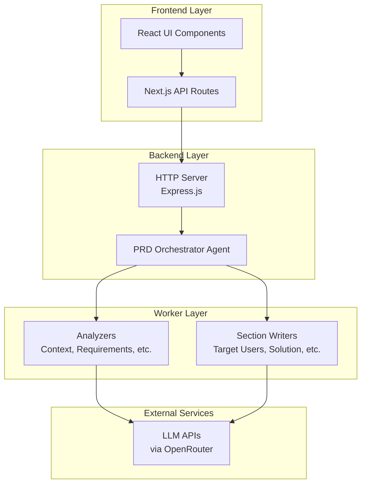

### Component Architecture

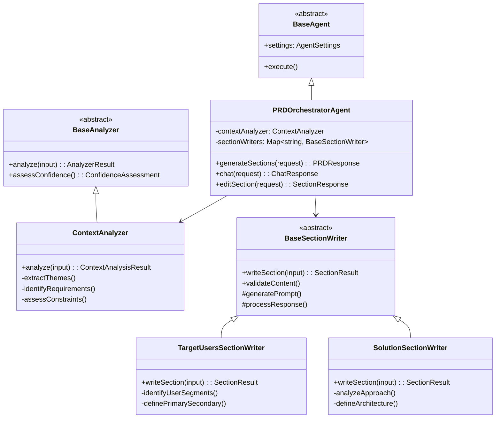

## Architectural Design Rationale

### Why This Architecture?

The PRD Agent's orchestrator-workers pattern with parallel processing was specifically designed to address the unique challenges of AI-powered document generation:

#### 1. **Parallel Processing for Performance**
- **Problem**: Sequential section generation would take 5x longer (each section requires 3-10 seconds)
- **Solution**: All sections generate concurrently using shared analysis context
- **Benefit**: Total processing time reduced from ~30-50 seconds to ~8-15 seconds

#### 2. **Shared Analysis to Reduce LLM Calls**
- **Problem**: Each section needing separate context analysis would require 5+ additional LLM calls
- **Solution**: Single comprehensive analysis shared across all section writers
- **Benefit**: Reduced API costs, consistent context interpretation, faster processing

#### 3. **Hierarchical Worker Pattern for Maintainability**
- **Problem**: Monolithic generation approach becomes unwieldy and hard to debug
- **Solution**: Specialized workers with clear responsibilities and interfaces
- **Benefit**: Easy to test, debug, and extend individual sections without affecting others

#### 4. **Stateless Design for Scalability**
- **Problem**: Session management complicates horizontal scaling and error recovery
- **Solution**: Each request creates fresh agent instance with all context provided
- **Benefit**: No session cleanup, easy horizontal scaling, simplified error recovery

#### 5. **Confidence Assessment for Quality Assurance**
- **Problem**: Users need to understand reliability of generated content
- **Solution**: Multi-factor confidence scoring per section and overall
- **Benefit**: Users can identify which sections need refinement

#### 6. **Flexible Section Targeting**
- **Problem**: Users often want to update specific sections without regenerating everything
- **Solution**: Section-specific routing and targeted updates
- **Benefit**: Faster iterations, preserved quality content, efficient resource usage

### Trade-offs and Design Decisions

#### **Parallel vs Sequential Processing**
- **Chosen**: Parallel with shared analysis
- **Alternative**: Sequential with context passing between sections
- **Rationale**: Performance gains outweigh potential cross-section dependencies

#### **Stateless vs Stateful Agents**
- **Chosen**: Stateless with context in request
- **Alternative**: Persistent agent instances with session management
- **Rationale**: Simpler scaling and error recovery outweigh memory efficiency

#### **Specialized Workers vs Generic Generation**
- **Chosen**: Section-specific workers with domain expertise
- **Alternative**: Single generic generator with section parameters
- **Rationale**: Better section quality and maintainability justify complexity

## Data Flow and Processing Pipeline

### Generation vs Edit Flow Handling

The architecture handles two distinct but related workflows through the same orchestrator pattern:

#### **Generation Flow (New PRD)**
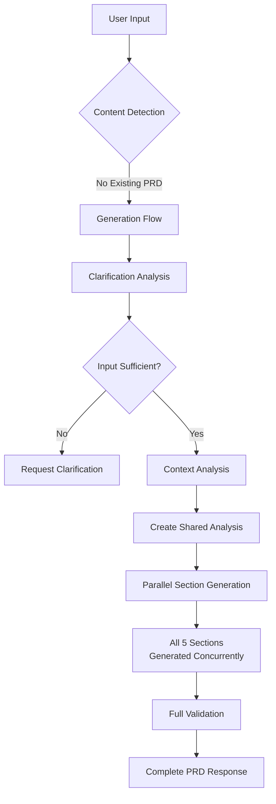

#### **Edit Flow (Existing PRD)**
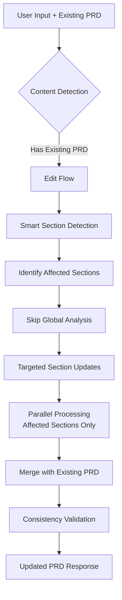

#### **Key Differences in Flow Handling**

| Aspect | Generation Flow | Edit Flow |
|--------|----------------|-----------|
| **Analysis Phase** | Full context + clarification analysis | Skip analysis, use existing PRD context |
| **Section Scope** | All 5 sections processed | Only affected sections detected and processed |
| **Processing Method** | `generateSections()` method | `chat()` method with edit operation |
| **Validation Focus** | Completeness and coherence | Consistency with existing sections |
| **Context Source** | User input + conversation history | Existing PRD + edit instructions |
| **Performance** | 8-15 seconds (full generation) | 2-8 seconds (selective updates) |

### Detailed Request Processing Flow

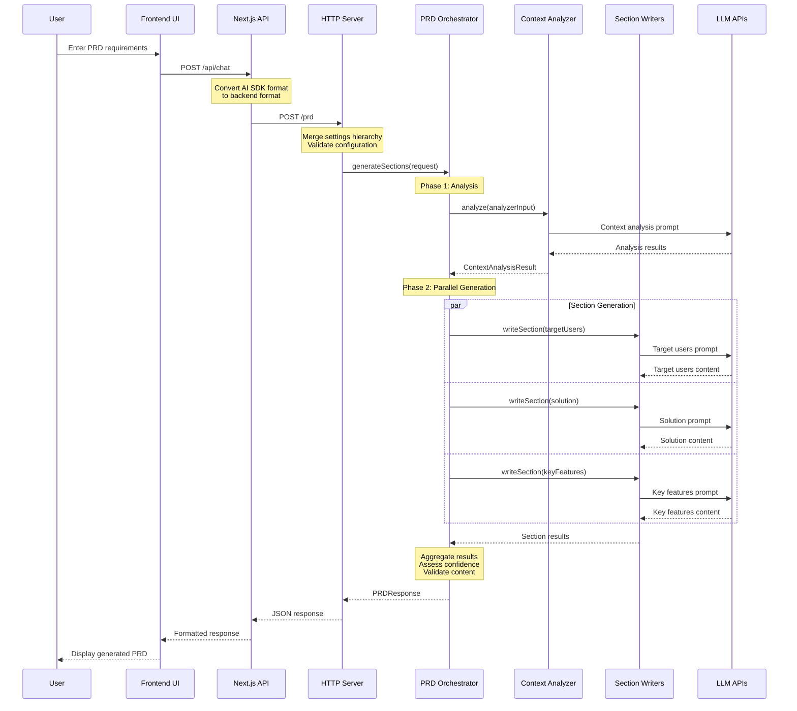

### Section Generation Pipeline

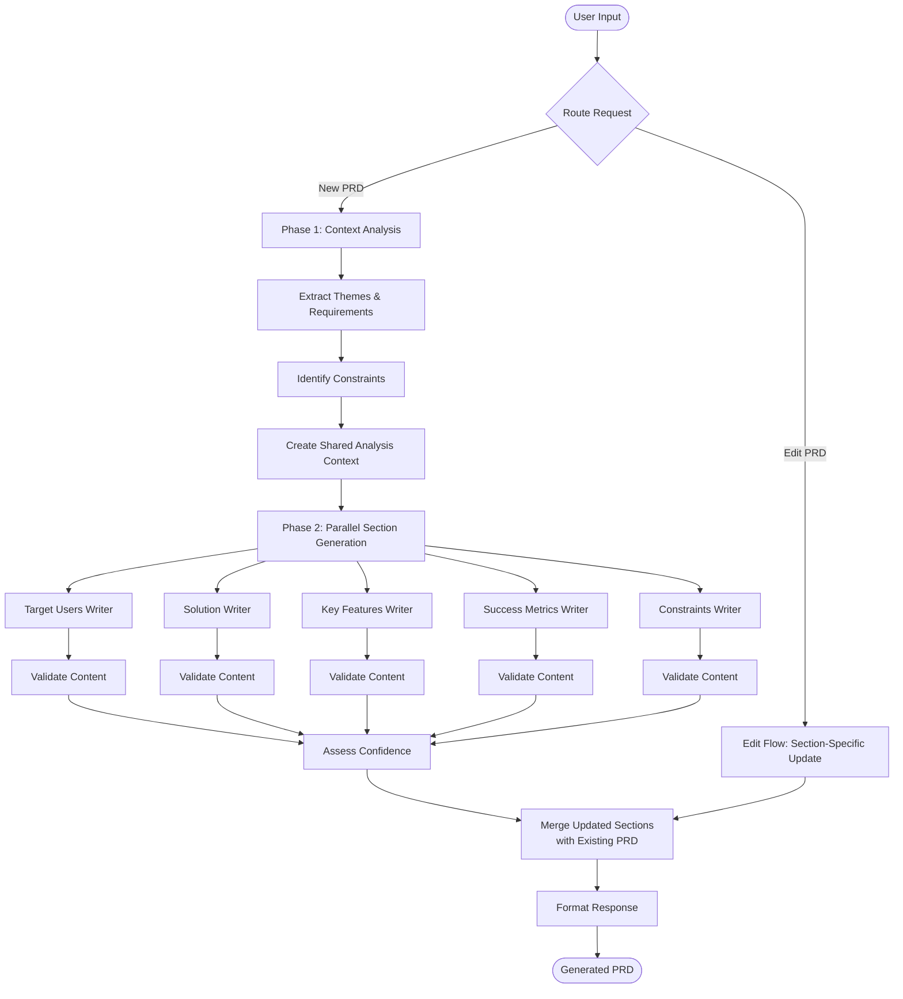

## Worker Architecture

### Context Analysis Phase

The first phase involves centralized context analysis that generates shared insights for all section writers:

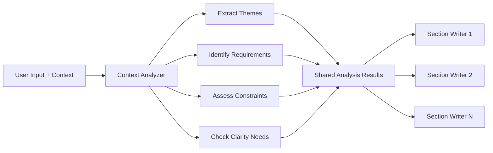

### Parallel Section Generation

The second phase generates all PRD sections concurrently using shared analysis:

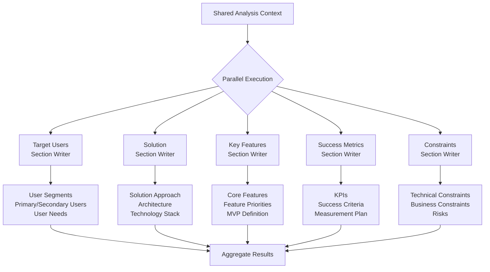

## Error Handling and Resilience

### Multi-Layer Error Handling

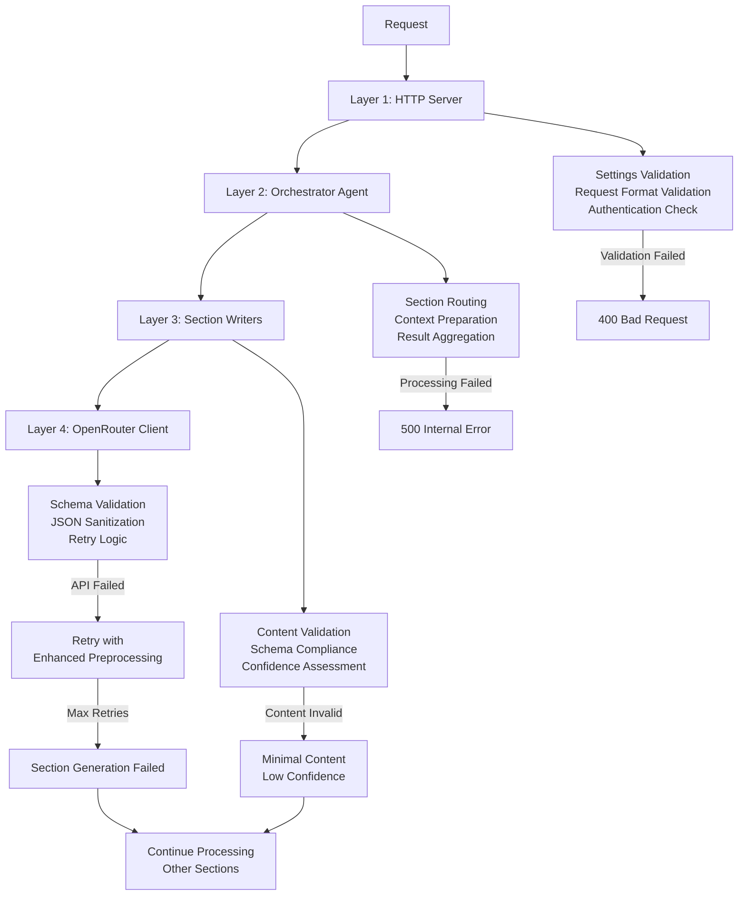

### Confidence Assessment System

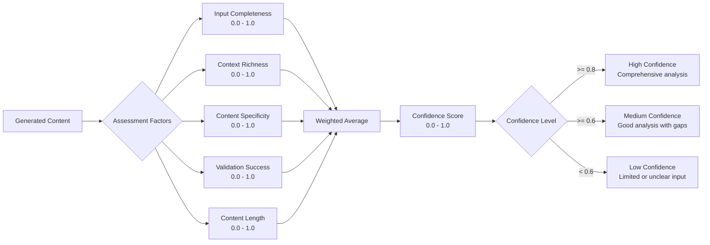

## Configuration and Settings Management

### Hierarchical Settings Resolution

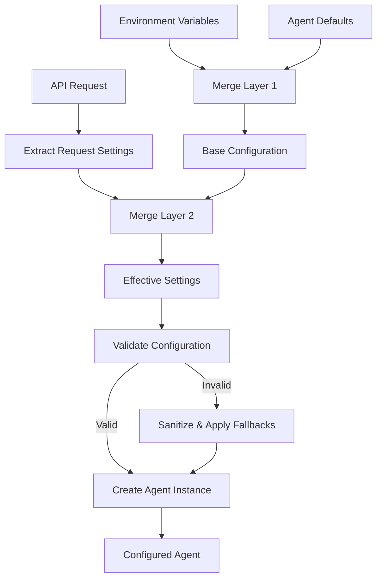

### Model Compatibility System

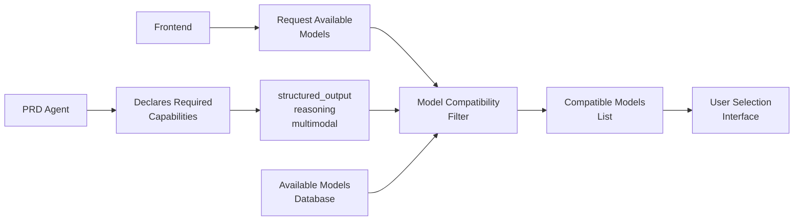

## Performance Characteristics

### Processing Time Optimization

The architecture optimizes processing time through:

1. **Parallel Section Generation**: All sections generate concurrently
2. **Shared Context Analysis**: Single analysis run shared across workers
3. **Independent Section Processing**: No sequential dependencies between sections
4. **Stateless Design**: No session overhead or state management

### Scalability Considerations

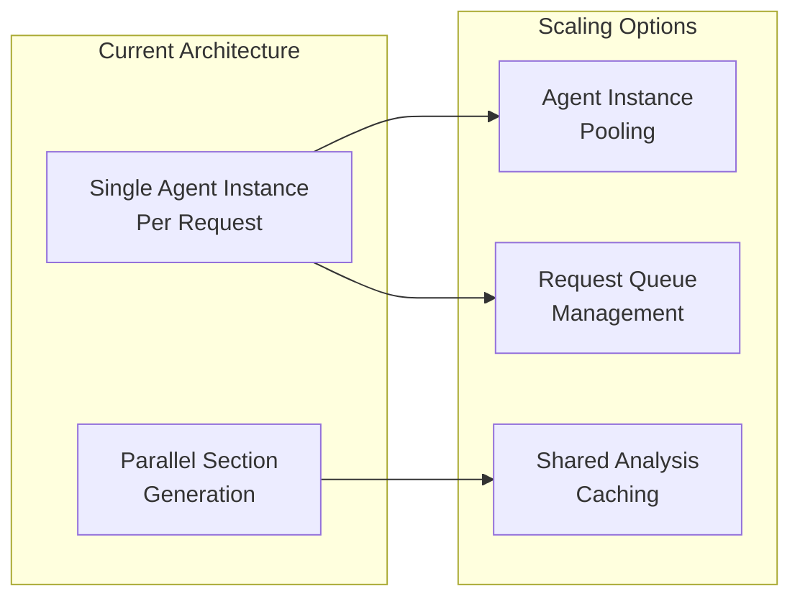

## Integration Points

### External Service Dependencies

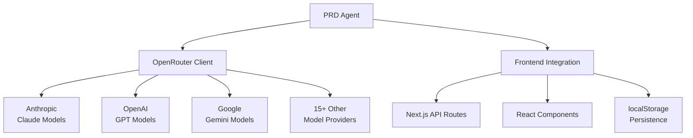

### API Endpoints

The PRD Agent exposes the following HTTP endpoints:

- `GET /health` - Agent health check and configuration
- `POST /prd` - Generate new PRD from input
- `POST /prd/edit` - Edit existing PRD sections
- `POST /prd/sections` - Update specific sections
- `GET /prd/section/{name}` - Get specific section

## Security Considerations

### Input Validation and Sanitization

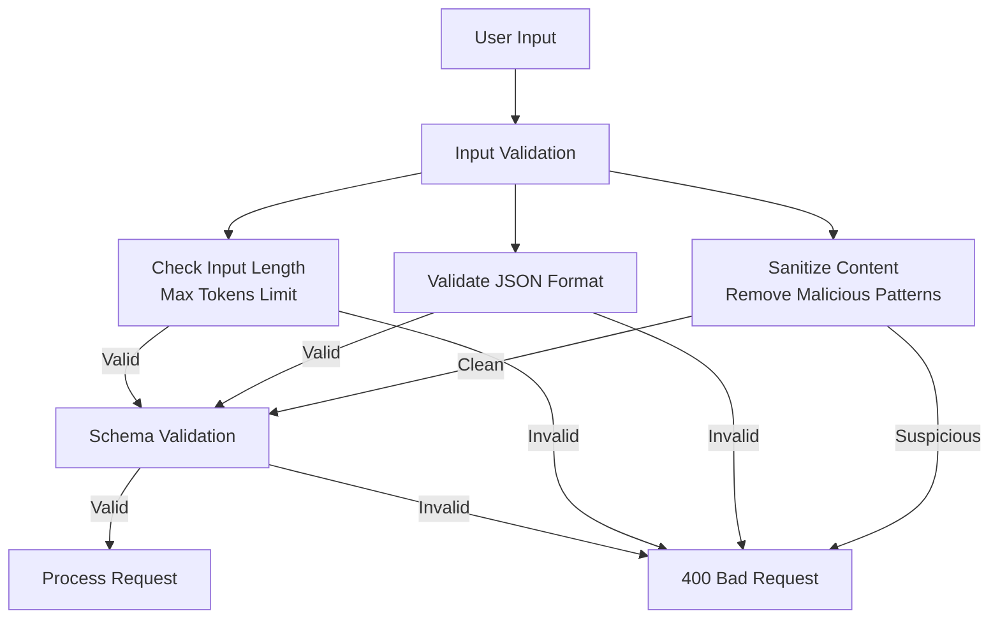

### API Key Management

- API keys never logged or exposed
- Optional user-provided keys override defaults
- Environment variable fallbacks
- Secure key validation before LLM calls

## Advanced Architecture Features

### Smart Section Detection for Edits

The edit flow uses keyword-based section detection to identify which sections need updates:

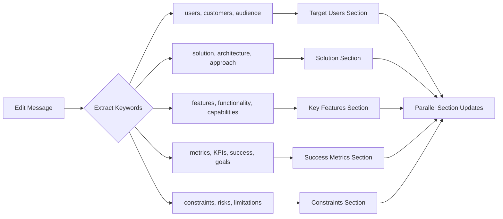

### Context Preservation Strategy

The architecture carefully preserves and enhances context between generation and edit flows:

#### **Generation Context Chain**
```
User Input → Conversation History → Context Analysis → Shared Analysis Results → Section Writers
```

#### **Edit Context Chain**
```
User Edit + Existing PRD → Section Detection → Existing PRD Context → Targeted Section Writers
```

### Resilience Through Graceful Degradation

The system includes multiple fallback mechanisms:

1. **Section-Level Failures**: Other sections continue processing
2. **Analysis Failures**: Falls back to minimal context analysis
3. **Individual Worker Failures**: Returns existing content with low confidence
4. **LLM API Failures**: Retry with enhanced preprocessing and fallback models

### Performance Optimization Techniques

#### **LLM Call Optimization**
- **Batch Context Preparation**: Single context analysis shared across all workers
- **Parallel Processing**: All sections generate simultaneously  
- **Smart Caching**: Shared analysis results prevent duplicate LLM calls
- **Request Deduplication**: Identical section updates use cached results

#### **Memory Management**
- **Stateless Agents**: No memory leaks from persistent sessions
- **Context Scoping**: Only relevant context passed to each worker
- **Result Streaming**: Large responses handled efficiently
- **Garbage Collection**: Automatic cleanup after request completion

## Monitoring and Observability

The system provides comprehensive observability through:

1. **Request/Response Logging**: All API interactions logged with timing metrics
2. **Confidence Metrics**: Per-section and overall confidence tracking with reasons
3. **Processing Time Metrics**: Detailed timing for analysis, generation, and validation phases
4. **Error Classification**: Structured error reporting and categorization by layer
5. **Model Performance Tracking**: Success rates per model and provider
6. **Section Success Rates**: Individual section writer performance metrics
7. **Edit vs Generation Metrics**: Comparative performance analysis between flows

### Key Performance Indicators

| Metric | Generation Flow | Edit Flow | Target |
|--------|----------------|-----------|---------|
| **Total Processing Time** | 8-15 seconds | 2-8 seconds | < 10s avg |
| **Section Success Rate** | 98%+ | 99%+ | > 95% |
| **Confidence Score** | 0.7-0.9 avg | 0.8-0.95 avg | > 0.6 |
| **LLM API Calls** | 6-7 calls | 2-4 calls | Minimize |
| **Error Recovery Rate** | 95%+ | 98%+ | > 90% |

This technical architecture demonstrates a mature, production-ready system designed for reliability, performance, and maintainability in AI-powered document generation scenarios. The dual-flow architecture efficiently handles both comprehensive PRD generation and targeted section editing while maintaining consistency, quality, and optimal resource utilization.
