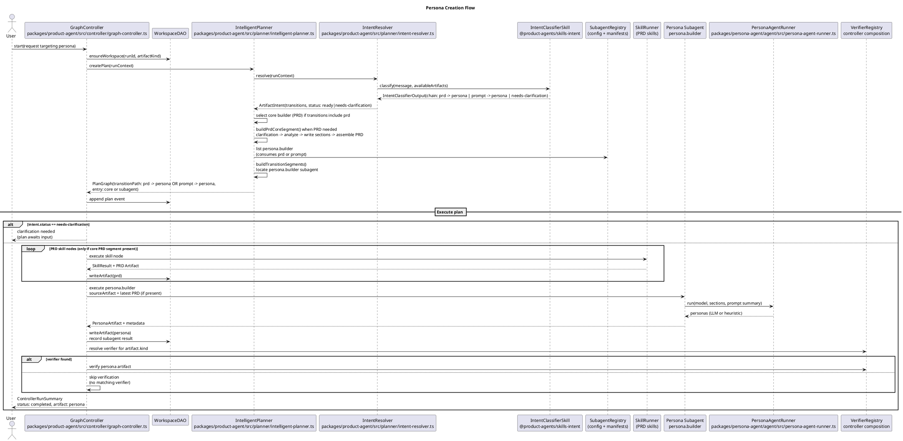

# Persona Creation Sequence

The diagram shows how a persona request flows through the planner, graph controller, and persona subagent to produce a `persona` artifact. The planner is artifact-agnostic: it selects a core builder from a registry (PRD by default) and only seeds `prompt` when a subagent allows it. The controller chooses verifiers by artifact kind from its registry and skips verification if no matching verifier exists. A clarification intent short-circuits execution until the user responds.

